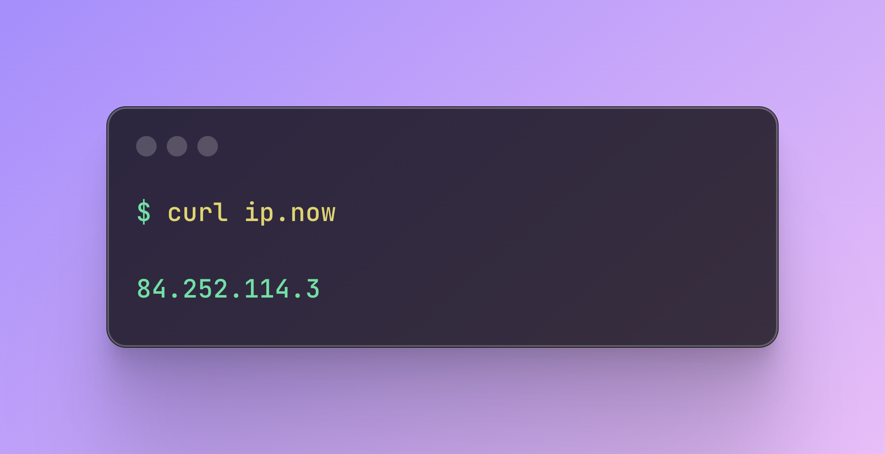
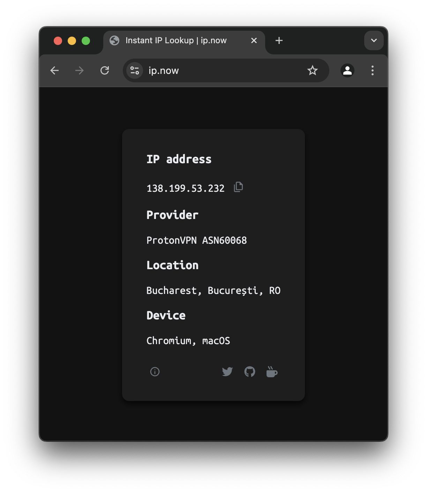

[](https://status.ip.now/)

# ip.now

I needed an excuse to tinker with Cloudflare Workers, and for whatever reason this was it.

So there you have it, yet *another* "What is my IP" site.

:white_check_mark: Instant access with `curl ip.now`

:white_check_mark: Copy to clipboard

:white_check_mark: Provider info

:white_check_mark: Location info

:white_check_mark: Device info

:white_check_mark: Auto light/dark mode per system settings

:white_check_mark: Webapp works seemlessly on all devices

## Usage

**Browser**:

Simply head over to [ip.now](https://ip.now) to see your IP, click or tap the IP address to copy to clipboard.

**Terminal**:

Using [ip.now](https://ip.now) from a terminal is easy:

```
curl ip.now
```

Options to copy to clipboard from terminal may vary based on your system. Here are some examples to get you started:

In MacOS, open a terminal and do:

```
curl ip.now | pbcopy
```

In Linux:

Many ways available but I like `xclip`. Make sure that is installed, then:

```
curl ip.now | xclip -selection clipboard
```

Windows:

Open PowerShell and do:

```
curl ip.now | Set-Clipboard
```
With that, you instantly have your public IP address copied to clipboard.

## Screenshots

<div align="center">
	
</div>

<div align="center">
	
	  
</div>

# Support

Follow me on Twitter, support me right here on GitHub or Buy Me a Coffee! Any and all support is deeply appreciated:

<div align="center">
	<a href="https://twitter.com/gomarcd"></a>&nbsp;&nbsp;&nbsp;&nbsp;
  <a href="https://github.com/sponsors/gomarcd">
    
  </a>&nbsp;&nbsp;&nbsp;&nbsp;
  <a href="https://www.buymeacoffee.com/gomarcd">
    
  </a>
</div>
