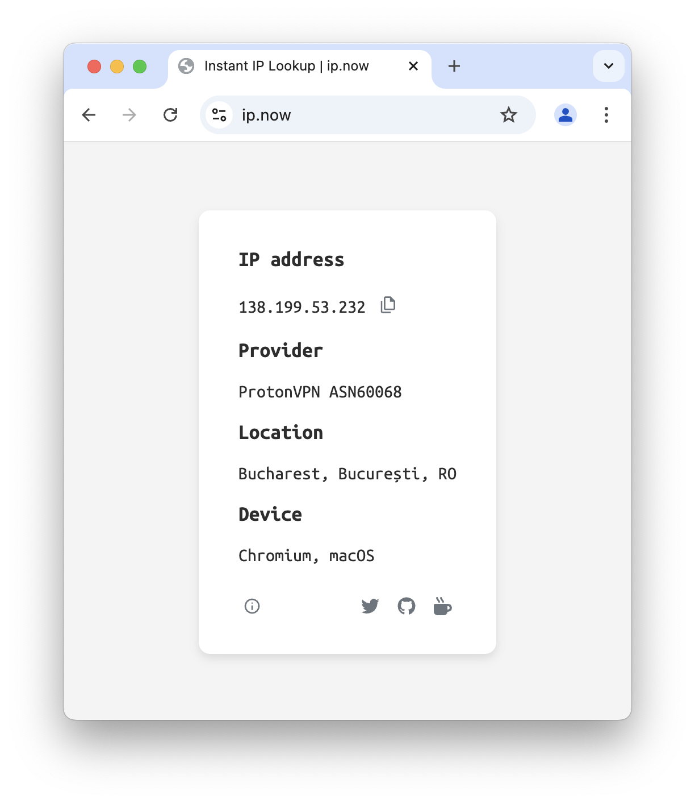

[](https://status.myip.fail/)

# myip.fail

I needed an excuse to tinker with Cloudflare Workers, and for whatever reason this was it.

So there you have it, yet *another* "What is my IP" site.

:white_check_mark: instant access with `curl`

:white_check_mark: Copy to clipboard

:white_check_mark: Provider info

:white_check_mark: Location info

:white_check_mark: Device info

## Usage

**Browser**:

Simply head over to [myip.fail](https://myip.fail) to see your IP, click or tap anywhere on the card to copy the IP to clipboard.

**Terminal**:

Using [myip.fail](https://myip.fail) from a terminal is easy:

```
curl myip.fail
```

Options to copy to clipboard from terminal may vary based on your system. Here are some examples to get you started:

In MacOS, open a terminal and do:

```
curl myip.fail | pbcopy
```

In Linux:

Many ways available but I like `xclip`. Make sure that is installed, then:

```
curl myip.fail | xclip -selection clipboard
```

Windows:

Open PowerShell and do:

```
curl myip.fail | Set-Clipboard
```





